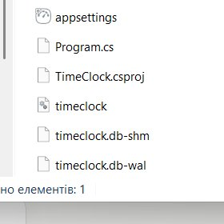
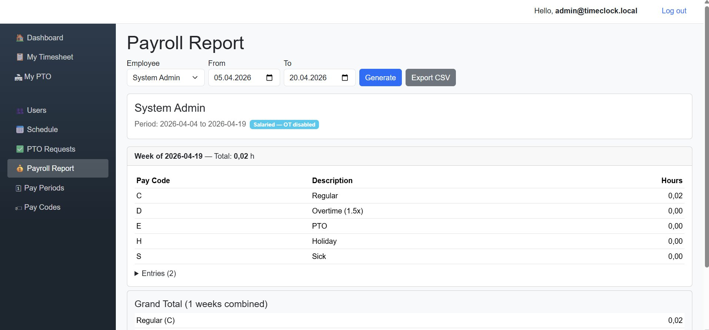
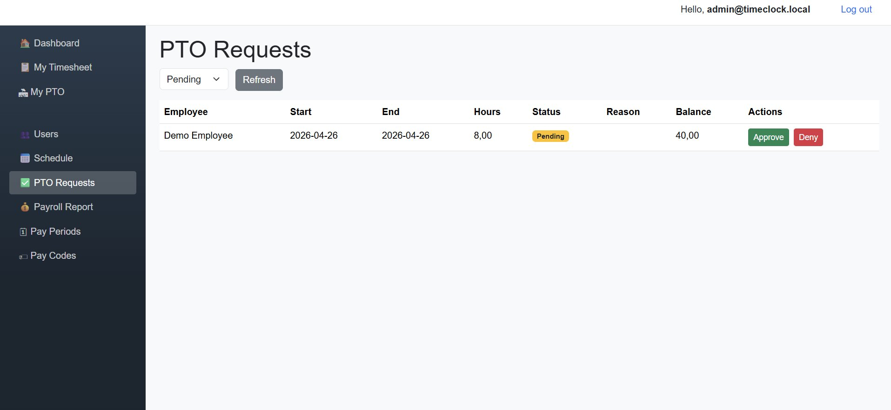
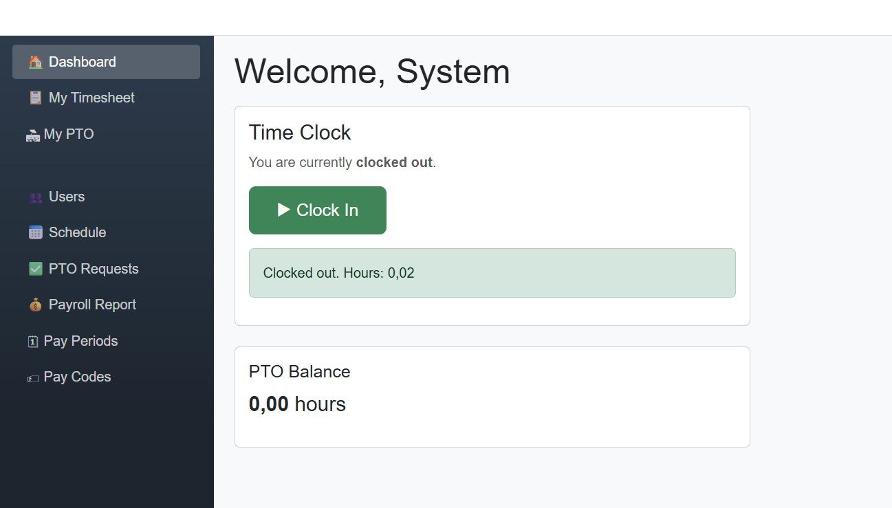

# TimeClock

> A full-stack employee time tracking and payroll system with role-based access, scheduling, PTO management, and automated overtime calculation.

[](https://dotnet.microsoft.com/)
[](https://dotnet.microsoft.com/apps/aspnet/web-apps/blazor)
[](https://learn.microsoft.com/ef/core/)
[](https://www.sqlite.org/)
[](LICENSE)

TimeClock is a web-based workforce management tool built to replace manual timesheets and payroll spreadsheets. It handles the full cycle — from an employee clocking in at the start of their shift, through PTO requests and approvals, to a finished payroll report with automatically calculated overtime and customizable pay codes.

Built as a portfolio project to demonstrate end-to-end ASP.NET Core 8 development: Identity, role-based authorization, EF Core with Code-First migrations, Blazor Server interactivity, and realistic business logic (overtime rules, pay periods, PTO accruals).

---

## Screenshots


| Dashboard (Employee) | Payroll Report (Admin) |
|---|---|
|  |  |

| PTO Approvals | User Management |
|---|---|
|  |  |

---

## Features

**Authentication & Authorization**
- ASP.NET Core Identity with 4 roles: Admin, Manager, Supervisor, Basic User
- Policy-based access control per page
- Automatic role-aware navigation menu

**Time Tracking**
- Clock in / Clock out with live elapsed timer
- IP address logging on every punch
- Optional IP restriction per user (whitelist allowed addresses)
- Schedule-based clock-in windows (configurable minutes before/after shift start)

**Scheduling**
- Shift creation with start/end times and notes
- Enforceable clock-in windows (opt-in per shift)
- Upcoming shifts view for managers

**PTO Management**
- Per-user PTO balance with configurable accrual rates
- Request / Approve / Deny workflow
- Automatic balance adjustment on approval
- Full transaction history (accruals + usage)

**Payroll**
- Custom pay periods: Weekly, Bi-Weekly, Semi-Monthly, Monthly
- Configurable overtime threshold (default 40h/week) and multiplier (default 1.5×)
- Salaried employee handling (OT calculation disabled)
- Customizable pay codes (C=Regular, D=Overtime, E=PTO, H=Holiday, S=Sick — editable)
- Week-by-week breakdown with grand totals across the period
- CSV export for payroll system import

---

## Tech Stack

| Layer | Technology |
|---|---|
| **Backend** | ASP.NET Core 8, C# 12 |
| **Frontend** | Blazor Server, Razor Components, Bootstrap 5 |
| **ORM** | Entity Framework Core 8 (Code-First) |
| **Database** | SQLite (demo), easily swappable for PostgreSQL / SQL Server |
| **Auth** | ASP.NET Core Identity with cookie authentication |

No JavaScript frameworks. No client-side build pipeline. Single-project solution that runs out of the box.

---

## Architecture

```
TimeClock/
├── Program.cs              # DI setup, Identity, middleware pipeline
├── Data/
│   ├── ApplicationDbContext.cs   # EF Core context with Identity + domain entities
│   └── DbSeeder.cs               # Seeds roles, pay codes, demo users on first run
├── Models/                  # 6 domain entities
│   ├── ApplicationUser.cs        # Extends IdentityUser with HR fields
│   ├── TimeEntry.cs              # Clock in/out records
│   ├── ScheduleEntry.cs          # Planned shifts
│   ├── PtoRequest.cs             # + PtoTransaction (audit log)
│   ├── PayPeriod.cs              # Weekly/Bi-weekly/etc. + OT rules
│   └── PayCode.cs                # Customizable payroll codes
├── Services/                # Business logic (thin over EF, easy to unit-test)
│   ├── TimeClockService.cs       # Clock in/out + IP & window validation
│   ├── PayrollService.cs         # Overtime calculation per pay period
│   └── PtoService.cs             # Request / accrual / balance management
└── Components/              # Blazor UI
    ├── Layout/                    # MainLayout + NavMenu
    ├── Pages/                     # Dashboard, MyTimesheet, MyPto
    │   └── Admin/                 # Users, Schedule, PtoRequests, Payroll, PayPeriods, PayCodes
    └── Account/                   # Login + Identity helpers
```

Business logic is isolated in the `Services/` folder. Razor pages only orchestrate UI state and delegate to services — which makes the logic testable and the UI thin.

### Overtime calculation — the critical piece

Grouped by calendar week (Sunday–Saturday by default). For each week:

- If the employee is **salaried**, all hours go to Regular — no OT.
- Otherwise, hours above the pay period's `OvertimeThresholdHours` (default 40) become Overtime at the configured multiplier (default 1.5×).
- PTO, Holiday, and Sick hours are tracked in separate buckets and **do not** count toward the OT threshold — matching standard US payroll practice.

This logic lives in `PayrollService.BuildReportAsync` and is the first thing I would cover with unit tests when moving to production.

---

## Getting Started

### Prerequisites

- [.NET 8 SDK](https://dotnet.microsoft.com/download/dotnet/8.0)
- Any OS (Windows, macOS, Linux)

### Run locally

```bash
git clone https://github.com/YOUR-USERNAME/timeclock.git
cd timeclock/TimeClock
dotnet run
```

Open http://localhost:5080 in your browser.

The database (`timeclock.db`) is created automatically on first run, with roles, pay codes, and two demo accounts seeded.

### Demo credentials

| Role | Email | Password |
|---|---|---|
| Admin | `admin@timeclock.local` | `Admin123!` |
| Employee | `employee@timeclock.local` | `Employee123!` |

### Quick walkthrough

1. Log in as the employee → click **Clock In** on the Dashboard
2. Wait a few seconds, watch the live timer, then click **Clock Out**
3. Check **My Timesheet** — your shift shows with calculated hours and pay code
4. Go to **My PTO** → submit a request for 8 hours
5. Log out → log in as admin
6. Go to **PTO Requests** → Approve the request (the employee's balance updates automatically)
7. Go to **Payroll Report** → select an employee, generate, export as CSV

---

## What I Would Add for Production

The scope of this repo is intentionally focused on the core workforce-management domain. A production deployment would layer on:

- **Tests** — unit tests for `PayrollService` (overtime edge cases), integration tests for auth + approval flows
- **Real database** — switch from SQLite to PostgreSQL or SQL Server (one-line change in `Program.cs`)
- **Migrations** — replace `EnsureCreated` with proper EF migrations (`dotnet ef migrations add InitialCreate`)
- **Email notifications** — PTO approval/denial emails via SendGrid or SMTP
- **Excel export** — in addition to CSV (via ClosedXML)
- **Audit log** — who edited which time entry and when
- **Two-factor auth** for admin accounts
- **Rate limiting** on login endpoint
- **Docker** + `docker-compose.yml` for one-command deployment
- **CI/CD** — GitHub Actions for build + test on every push

---

## License

MIT — see [LICENSE](LICENSE) for details.

---

*Built with care by a developer who believes clean code and solved business problems matter more than framework fashion.*
